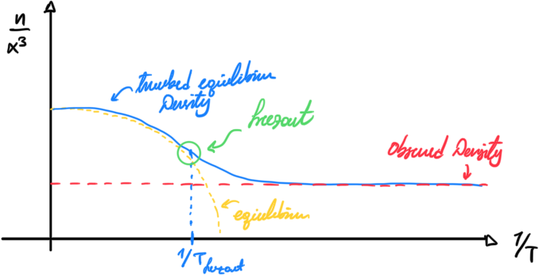

# Nucleosynthesis in the Big-Bang

Nucleosynthesis is the process of arriving to the densities of matter that we observe from the primordial elements that the universe was made of. Essentially, the universe reached some equilibrium at some point, an equilibrium that we can predict using statistical mechanics. 

## Nuclear Statistical Equilibrium

This is referred to as the **Nuclear Statistical Equilibrium (NSE)** which can take multiple forms. Consider **kinetic equilibrium**, where the number density of a slow particle $A$ can be given by

$$
n_A = g_A \left(\frac{m_A T}{2\pi}\right)^{\frac{3}{2}}\, \exp\left(\frac{\mu_A - m_A}{T}\right)
$$

here, $m_A$ is the mass and $\mu_A$ is the chemical potential, $T$ is the temperature etc. etc.

## Boltzmann Equation

Consider $2-2$ scattering, eventually the two populations (DM and SM matter) will reach equilibrium. We can track that equilibrium. However, due to the expansion, something happens and they evolve out of sync. Suddenly the universe is too big for dark matter to interact with standard model matter, and then they go out of equilibrium. In particular we can model it like so

As a result, the equilibrium breaks, and the dark matter density is left untouched for the rest of the history of the universe resulting to the density we observe today!

### Derivation

Some stuff about derivation

### Playing Around

Let’s try to play around with a kid-friendly version of the equation. In particular the Boltzmann equation can be rewritten as

$$
\begin{align*}
\frac{dn}{dt} + 3T^2 n &= n^2-n_{eq}^2\\
t &= \frac{1}{T}
\end{align*}
$$

This is in the case of WIMPS, where we have a specific density equilibrium function $n_{eq}(T)$. We can attempt to solve so in temperature $T$ using the chain rule like so

$$
\begin{align*}
\frac{dn}{dT} &= \frac{dn}{dt} \frac{dt}{dT}\\
&= -\frac{dn}{dt} \frac{1}{T^2}\\

\frac{dn}{dt} &= -T^2 \frac{dn}{dT}
\end{align*}
$$

Therefore, by substituting we get

$$
\frac{dn}{dt} + 3n = \frac{n_{eq}^2 - n^2}{T^2}
$$
