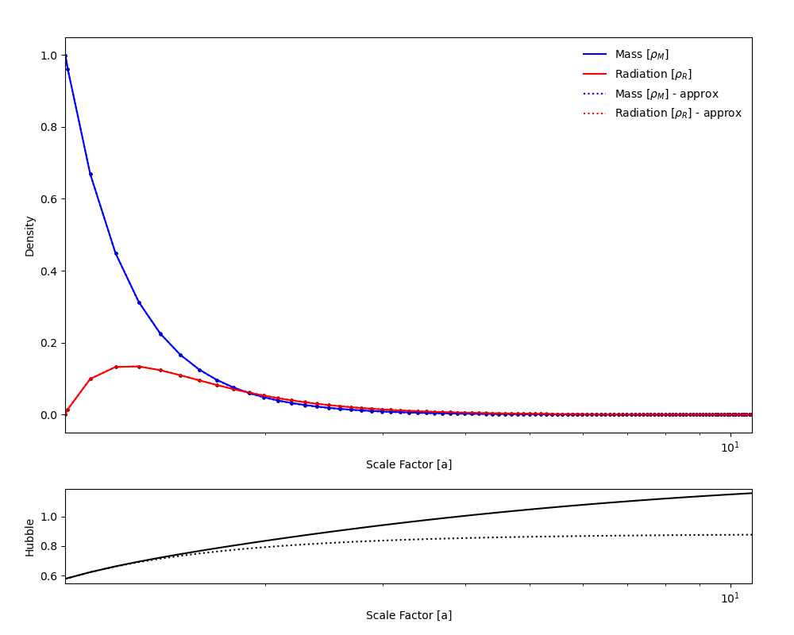

# Boltzmann Equation Solution

Consider the following system of equations
$$
\begin{align}
\dot\rho_M+3H\rho_M &= -\Gamma\rho_M\\
\dot\rho_R+4H\rho_R &= \Gamma\rho_M
\end{align},
$$
where $\Gamma$ is a constant and $H$ is given by
$$
H :=\frac{\dot a}{a}= \sqrt{\frac{\rho_M+\rho_R}{3M_p^2}},
$$
with $M_p$ the Plank mass. We will now consider a transformation of our variables to simplify the system of equations. To do so, we need to assume that the scale factor $a$ can be expressed as an invertible function of time $t$. This is a fair assumption as requiring $a$ to be non invertible would imply that the scale factor decreases over time (since we have positive gradient for the intial conditions), this can only happen if the total energy density is negative.

Therefore, assuming $a(t)$ invertible we can express
$$
\frac{d}{dt} = \frac{da}{dt}\frac{d}{da}=\dot a\frac{d}{da} = aH\frac{d}{da}
$$
Doing so we can rewrite the equations like so
$$
\begin{align}
\dot a\,\rho'_M+3\frac{\dot a}{a}\rho_M &= -\Gamma\rho_M\\
\dot a\,\rho'_R+4\frac{\dot a}{a}\rho_R &= \Gamma\rho_M
\end{align},
$$
where $\rho’$ indicates the derivative with respect to $\alpha$. Now consider the homogeneous case (i.e. where $\Gamma = 0$), we obtain the following
$$
\begin{align}
\rho'_M+3\frac{1}{a}\rho_M &= 0\\
\rho'_R+4\frac{1}{a}\rho_R &= 0.
\end{align}
$$
Using integrating factors we can express the equations as
$$
\begin{align}
\frac{d}{da}\left[\rho_M\left(\frac{a}{a_0}\right)^3\right] &= 0\\
\frac{d}{da}\left[\rho_R\left(\frac{a}{a_0}\right)^4\right] &= 0.
\end{align}
$$
It is now instructive to intoduce variables
$$
\begin{align}
M &\coloneqq \rho_M\left(\frac{a}{a_0}\right)^3\\
R &\coloneqq \rho_R\left(\frac{a}{a_0}\right)^4.
\end{align}
$$
And rewrite the original particular equations as
$$
\dot M = \dot\rho_M\left(\frac{a}{a_0}\right)^3+3\frac{\dot a}{a}\rho_M\left(\frac{a}{a_0}\right)^3=-\left(\frac{a}{a_0}\right)^3\Gamma\rho_M = -\Gamma M
$$
and similarly
$$
\dot R = \left(\frac{a}{a_0}\right)\Gamma M \coloneqq \bar\Gamma M
$$
For constant $\Gamma$, the solutions in time are trivial exponentials. However, we want to solve in scale factor. To do so we proceed as follows
$$
\begin{align}
M'&=-\frac{\Gamma}{aH} M\\
R'&= \frac{\Gamma}{a_0 H} M
\end{align}
$$
Now we can rewrite H as follows
$$
H^2=\frac{a_0^3a M^2 + a_0^4 R^2}{3a^4M_p^2} = \left(\frac{a_0}{a}\right)^3\frac{aM^2+a_0R^2}{3aM_p^2}
$$

This is a nonlinear system of ODE’s that is eazy to solve numerically, in order to learn how to take approximations for solving analytically in a valid regime. 

## Numerical Solutions

Using a simple RK Scheme we can solve the following IVP
$$
\begin{cases}
M'&=-\frac{\Gamma}{aH}M & a\in[1,\infty)\\
R'&=\frac{\Gamma}{H}M& a\in[1,\infty)\\
H &= \sqrt{\frac{aM^2+R^2}{3a^4M_p^2}} & a\in [1,\infty)\\
R(1)&=0\\
M(1)&=1\\
\end{cases}
$$
This is the numerical solution. The secret thing I did was to use H such that it is only dependent on the comoving Mass and not the Radiation. This is shown in the dotted lines. What? You can’t see the dotted lines? That’s because they overlap. And this is how to do approximations in cosmology.

Yet, with this approximation semijustified for the appropriate initial conditions we can see that this is an excellent analytical approximation as it gets rid of the dependence on M in both equations! So we can solve this the baby way. 

## Analytical Solutions

As long as we are in a region where $R << M$ we can apprixmate Hubble’s Constant like so
$$
H = \frac{M}{\sqrt{3a^3M_p^2}}=CMa^{-\frac{3}{2}}
$$
with some constant $C = 1/\sqrt{3}M_p$ 

The reason this approximation works is that at large scale factors $\rho_R$ is so suppressed that it compensates for the innacuracies in the calculation.